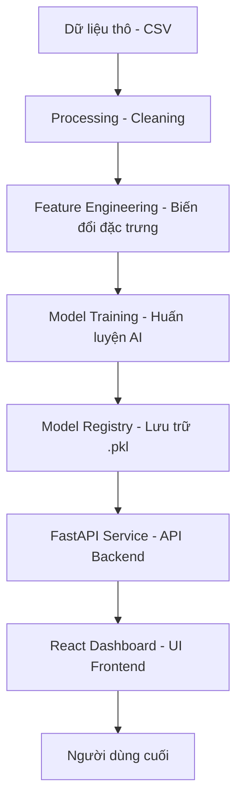

# 🏛️ Kiến Trúc Hệ Thống & Luồng Dữ Liệu (System Architecture)

Tài liệu này mô tả cách các thành phần trong dự án Fuel Price AI tương tác với nhau.

## 1. Sơ đồ Luồng dữ liệu (Data Pipeline)

## 2. Các thành phần chính

### 🏗️ Backend (Python - FastAPI)
- **Nhiệm vụ**: Load các mô hình AI đã huấn luyện, tiếp nhận tham số từ người dùng và trả về kết quả dự báo.
- **Tính toán**: Thực hiện dự báo đệ quy (Recursive Forecasting) để tính toán lộ trình giá nhiều ngày.

### 🎨 Frontend (React - Ant Design)
- **Nhiệm vụ**: Cung cấp giao diện trực quan, biểu đồ xu hướng và bảng điều khiển tham số.
- **Tương tác**: Giao tiếp với Backend thông qua giao thức RESTful API (JSON).

## 3. Quy trình Dự báo (Logic AI)
Khi người dùng nhấn nút "Predict":
1. Frontend đóng gói các tham số thành một đối tượng JSON.
2. Backend nhận JSON, đưa vào mô hình Scikit-learn/XGBoost.
3. Nếu dự báo > 1 ngày, Backend lấy kết quả của ngày T để làm đầu vào dự báo cho ngày T+1.
4. Kết quả cuối cùng được trả về để Frontend vẽ biểu đồ.
